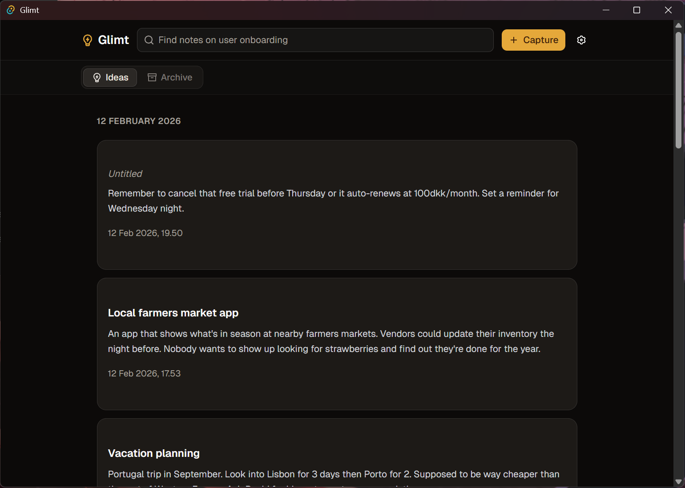
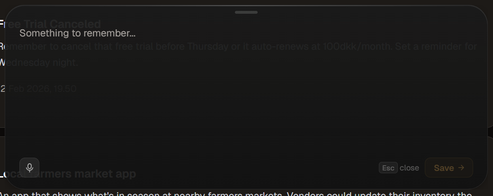

<p align="center">
  <h1 align="center">Glimt</h1>
  <p align="center">Capture ideas the moment they happen. Entirely on your device.</p>
</p>

<p align="center">
  <a href="https://github.com/varsan-g/Glimt/releases"></a>
  
</p>

<table>
  <tr>
    <td></td>
    <td></td>
  </tr>
</table>

Glimt is a lightweight desktop app for capturing ideas in seconds. Press a global hotkey, type or speak your thought, and it's saved instantly to a local database. There are no accounts, no cloud sync, and no external services. Everything stays on your machine, including voice transcription and search.

## Features

- **Instant capture.** Press a hotkey from any app to open a small floating editor. Type your idea and hit Enter. Done in under two seconds.
- **Voice input.** Speak instead of typing. Transcription runs locally and supports 99 languages. Start recording with a hotkey without even opening the capture window.
- **Semantic search.** Find ideas by meaning, not just exact words. Search "marketplace for freelancers" and find a note from last month about "Upwork takes too big a cut, there's room for something leaner."
- **AI-generated titles.** Short, descriptive titles are generated for each idea in the background, entirely on-device.
- **Markdown export.** Auto-export ideas as `.md` files with YAML frontmatter. Works with Obsidian, Logseq, or any markdown-based tool.
- **Timeline view.** Browse ideas grouped by day with inline editing, archive, and delete.
- **Command palette.** Quickly navigate and act with `Ctrl+K`.
- **System tray.** Minimizes to tray on close. Stays out of your way until you need it.
- **Customizable shortcuts.** Change the capture and recording hotkeys in settings.

## Download

Grab the latest release for your platform from [GitHub Releases](https://github.com/varsan-g/Glimt/releases):

- **Windows** `.exe` installer
- **Linux** `.deb` or `.AppImage`
- **macOS** `.dmg` (Apple Silicon)

<details>
<summary><strong>Build from source</strong></summary>

### Prerequisites

- [Bun](https://bun.sh/)
- [Rust](https://www.rust-lang.org/tools/install)
- [Tauri v2 prerequisites](https://v2.tauri.app/start/prerequisites/) for your platform

### Steps

```bash
git clone https://github.com/varsan-g/glimt.git
cd glimt
bun install
bun run tauri dev
```

The first launch downloads default AI models (~40 MB). After that, startup is instant.

To produce distributable installers:

```bash
bun run tauri build
```

### Dev commands

| Command | Description |
|---------|-------------|
| `bun run tauri dev` | Run the full desktop app |
| `bun run dev` | Vite dev server only (no Tauri) |
| `bun run lint` | ESLint |
| `bun run format` | Prettier |
| `bun run test` | Vitest |
| `cargo clippy --manifest-path src-tauri/Cargo.toml` | Lint Rust |
| `cargo fmt --manifest-path src-tauri/Cargo.toml` | Format Rust |

</details>

<details>
<summary><strong>Tech overview</strong></summary>

Glimt is built with [Tauri v2](https://v2.tauri.app/) (Rust backend, webview frontend), React 19, TypeScript, and Vite. The UI uses shadcn/ui on Tailwind CSS v4, with TipTap as the rich text editor and SQLite for local storage.

All AI inference runs on-device through [Transformers.js](https://huggingface.co/docs/transformers.js) in Web Workers, keeping the UI responsive. No data is sent to external services.

**Models (all ONNX, all local):**

| Purpose | Model | Details |
|---------|-------|---------|
| Speech-to-text | Whisper (multiple sizes) | ~40 MB default, larger options for higher accuracy |
| Embeddings | Multilingual E5 Small | 384 dimensions, 100+ languages |
| Title generation | SmolLM2-360M-Instruct | Lightweight on-device text generation |

</details>

## Contributing

Contributions are welcome. Please ensure lint and format checks pass before opening a pull request:

```bash
bun run lint
bun run format:check
cargo clippy --manifest-path src-tauri/Cargo.toml
cargo fmt --manifest-path src-tauri/Cargo.toml --check
```

If you find a bug or have a feature request, [open an issue](https://github.com/varsan-g/Glimt/issues).
